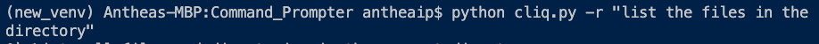
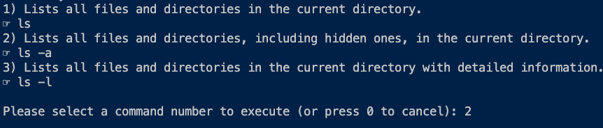
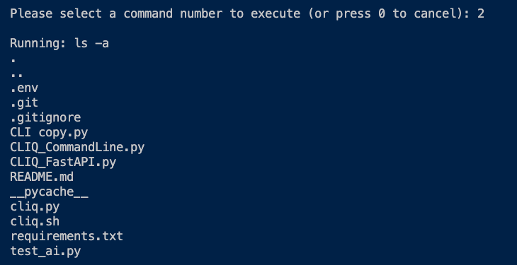
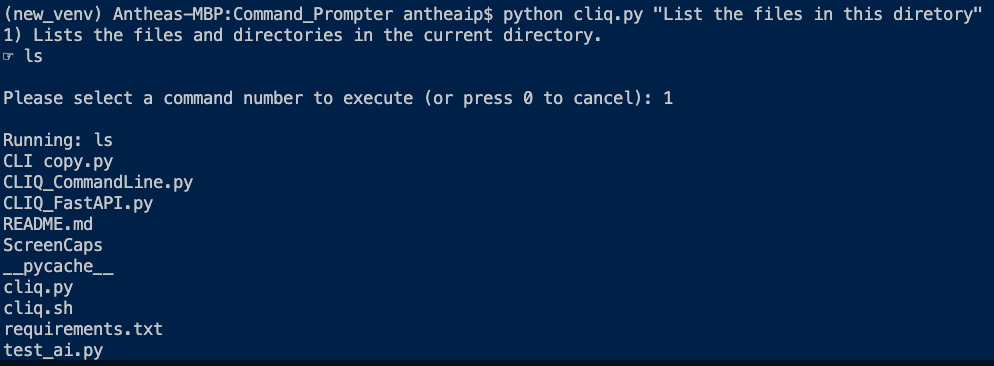
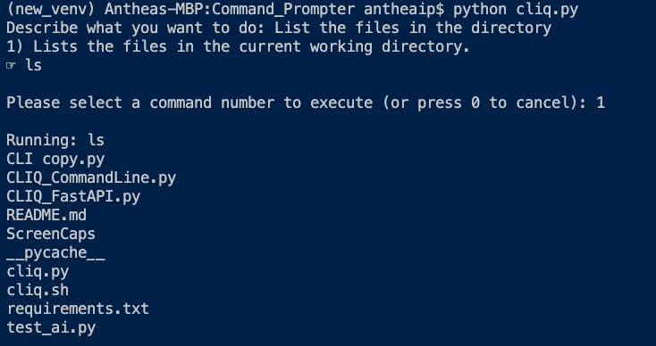

 ## Notes here

# To install

# Activate virtual environment
`source .venv/bin/activate`

# Install pip packages from requirements.txt
`pip install -r requirements.txt`

# Run program
-r: remote (optional)
query: your question (optional)
```
python cliq.py [-r] [query]
```


## Run with request in Command Line
### Remote LLM

</br>
#### Output of Options



#### Results




### Local LLM
#### Run with request in command line
##### (Do not use '-r)

</br>

### Run and be prompted for request

</br>